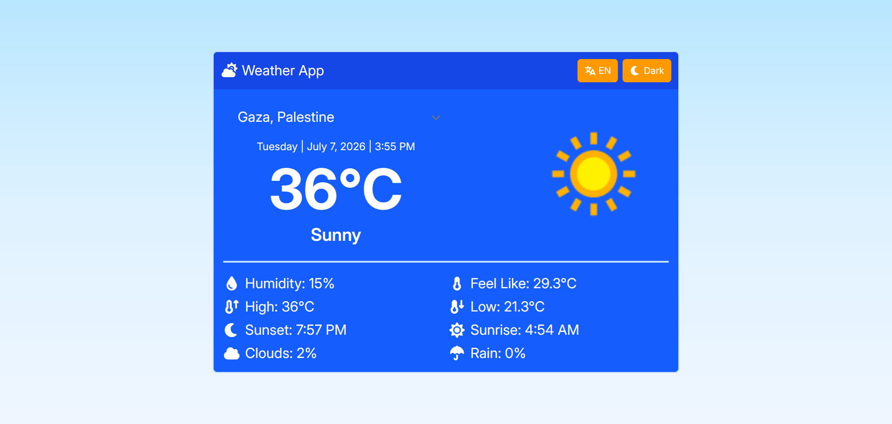
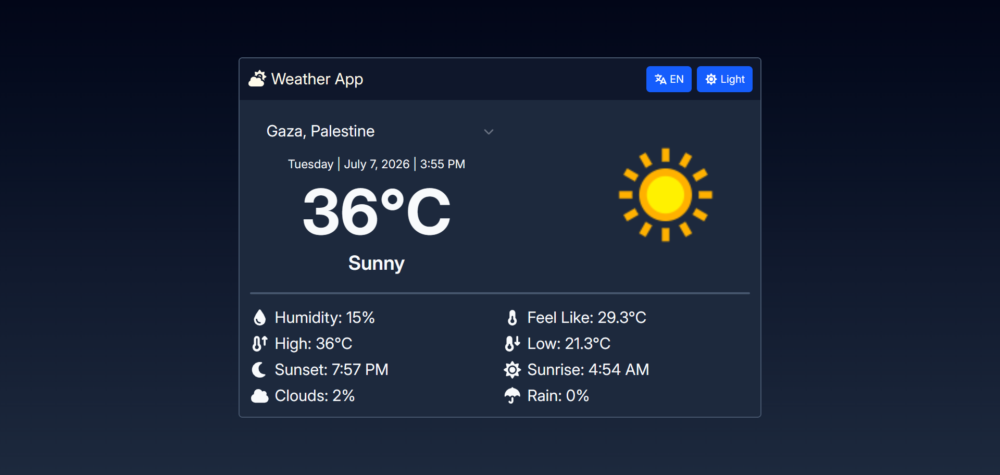
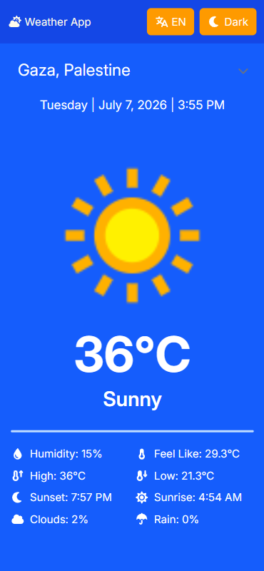

# Weather App


[](https://weather-app-chi-beige-37.vercel.app/)
[](https://react.dev/)
[](https://vite.dev/)
[](https://tailwindcss.com/)
[](https://www.i18next.com/)
[](LICENSE)

Weather App is a responsive, bilingual weather dashboard built with React and Vite. It delivers current conditions and day-level weather details for a selected city, with support for English and Arabic, light and dark themes, and persistent user preferences.

## Live Demo

https://weather-app-chi-beige-37.vercel.app/

## Screenshots

Placeholder for product screenshots:





## Features

### Context-driven weather experience

The app uses a dedicated weather hook to request forecast data from a configured weather API endpoint and map that response into a compact UI model. This keeps data fetching logic out of the presentation layer and makes state handling easier to maintain.

### City selection

Users can switch between a curated list of cities sourced from the local dataset in [src/data/cities.json](src/data/cities.json). The selected city is persisted in browser storage so the app remembers the user’s preference across refreshes.

### Bilingual interface

The interface supports both English and Arabic through i18next. Translation resources are loaded from [src/locales/en/translation.json](src/locales/en/translation.json) and [src/locales/ar/translation.json](src/locales/ar/translation.json), and the layout direction updates automatically between LTR and RTL.

### Theme switching

A lightweight theme system toggles between light and dark appearance and stores the selection in local storage. This is implemented through React context and applied across the app shell and card components.

### Responsive presentation

The interface follows a mobile-first layout using Tailwind CSS utility classes. On smaller screens, sections stack vertically; on larger screens, the layout expands into a more spacious dashboard-style presentation.

### Error and loading states

The app deliberately surfaces loading and error states instead of leaving the screen blank during network activity. This improves perceived reliability and provides clear feedback when requests fail.

### Accessible interactions

Interactive controls include visible focus styling, semantic button and select usage, and descriptive alt text for the weather image.

## Technologies Used

### Frontend

- React 19
- Vite 8
- Tailwind CSS 4
- Font Awesome icons

### State Management

- React Context for global theme and city selection

### Internationalization

- i18next
- react-i18next
- Browser language detection and persisted language preference

### Networking

- Axios
- Weather API endpoint configured through environment variables

### Development

- ESLint
- React Hooks plugin
- React Refresh plugin

## Folder Structure

```text
src/
  App.jsx
  i18n.js
  index.css
  main.jsx
  components/
    Button.jsx
    Container.jsx
    Divider.jsx
    ErrorScreen.jsx
    Header.jsx
    LoadingScreen.jsx
    Main.jsx
    Selector.jsx
  contexts/
    CityContext.jsx
    ThemeContext.jsx
  data/
    cities.json
  hooks/
    useWeather.jsx
  locales/
    ar/
      translation.json
    en/
      translation.json
  utilities/
    dateFormater.js
    numberFormater.js
    parseTime.js
public/
  fonts/
```

### Folder overview

- [src/components](src/components) contains reusable UI building blocks such as the header, weather output, selectors, and shared controls.
- [src/contexts](src/contexts) manages global state for city selection and theme preference.
- [src/hooks](src/hooks) contains the custom weather fetching hook.
- [src/locales](src/locales) holds language-specific translation resources.
- [src/utilities](src/utilities) centralizes date, number, and time formatting logic.
- [public/fonts](public/fonts) stores bundled font assets used by the app.

## Architecture

```text
App
  ↓
Contexts (Theme + City)
  ↓
Hooks (useWeather)
  ↓
Utilities (date, number, time parsing)
  ↓
Components (Header, Main, Selector, Error, Loading)
  ↓
Weather API
```

The application entry point in [src/main.jsx](src/main.jsx) wires the providers, initializes i18n, and renders the app shell. The root component in [src/App.jsx](src/App.jsx) composes the UI and reacts to loading, error, and success states from the weather hook.

## Weather API Integration

The app fetches data through a custom hook in [src/hooks/useWeather.jsx](src/hooks/useWeather.jsx). The request is built with Axios and uses the values from the environment variables:

- VITE_BASE_API_URL for the target endpoint
- VITE_API_KEY for authentication

The hook sends parameters for the selected city, a one-day forecast, and the current language. After the request resolves, it maps the payload into a simplified view model used by the UI.

## Internationalization

The project uses i18next with React integration. Configuration lives in [src/i18n.js](src/i18n.js), and translations are split into language-specific JSON files. The selected language is stored in local storage, and the app switches both the displayed text and the text direction between English and Arabic.

## Theme System

The theme layer is implemented through [src/contexts/ThemeContext.jsx](src/contexts/ThemeContext.jsx). The current theme is persisted in local storage and applied through utility classes in the app shell. The UI supports both a light mode and a dark mode experience.

## Responsive Design

The layout uses Tailwind CSS with mobile-first classes. Content stacks vertically on mobile devices and expands into a broader card-style layout on medium and large screens. The design prioritizes readability and keeps the weather details accessible without excessive layout complexity.

## Environment Variables

Create a local environment file with the following variables:

```env
VITE_API_KEY=your_weather_api_key
VITE_BASE_API_URL=https://your-weather-api-endpoint
```

These values are consumed by the weather hook at runtime.

## Installation

```bash
git clone https://github.com/MoSokara/weather-app.git
cd weather-app
npm install
npm run dev
```

## Build

```bash
npm run build
```

## Preview

```bash
npm run preview
```

## Deployment

The project is built as a standard Vite application and can be deployed to any static hosting provider.

### Netlify

- Connect the repository to Netlify
- Set the same environment variables in the site settings
- Deploy the production build from the Vite output directory

### Vercel

- Import the repository in Vercel
- Add the environment variables in project settings
- Use the default Vite build settings

## Future Improvements

Potential next steps for the project include:

- Hourly and multi-day forecasts
- Geolocation-based weather lookup
- Offline support and caching
- Search suggestions and improved city discovery
- Additional weather metrics and charts

## Lessons Learned

This project demonstrates how a small UI can become a well-structured product when state management, styling, and localization are separated into clear layers. The implementation reinforced the value of custom hooks for API concerns, context providers for shared preferences, and utility functions for consistent formatting across languages.

## Author

Maintained by MoSokara.

- GitHub: https://github.com/MoSokara
- LinkedIn: https://www.linkedin.com/in/mosokara
- Portfolio: https://mosokara.vercel.app/

## License

This project is licensed under the MIT License.
